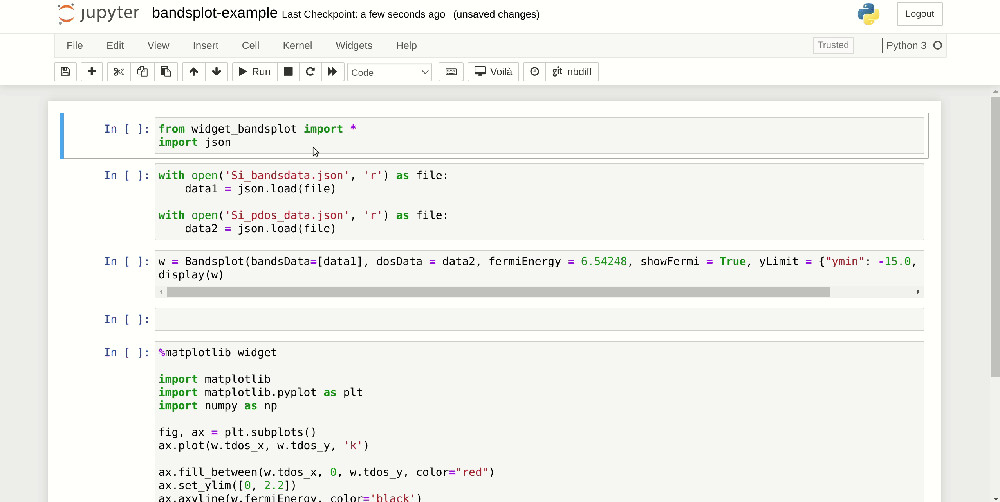

widget-bandsplot
===============================

A Jupyter widget to plot bandstructures. The widget is using the bands-widget Javascript
package, which is developed by Materials Cloud group.

https://github.com/materialscloud-org/bands-widget

Installation
------------

To install use pip:

    $ pip install widget_bandsplot

For a development installation (requires [Node.js](https://nodejs.org) and [Yarn version 1](https://classic.yarnpkg.com/)),

    $ git clone https://github.com/osscar/widget-bandsplot.git
    $ cd widget-bandsplot
    $ pip install -e .
    $ jupyter nbextension install --py --symlink --overwrite --sys-prefix widget_bandsplot
    $ jupyter nbextension enable --py --sys-prefix widget_bandsplot

When actively developing your extension for JupyterLab, run the command:

    $ jupyter labextension develop --overwrite widget_bandsplot

Then you need to rebuild the JS when you make a code change:

    $ cd js
    $ yarn run build

You then need to refresh the JupyterLab page when your javascript changes.

## Acknowledgements

We acknowledge support from the EPFL Open Science Fund via the [OSSCAR](http://www.osscar.org) project.

