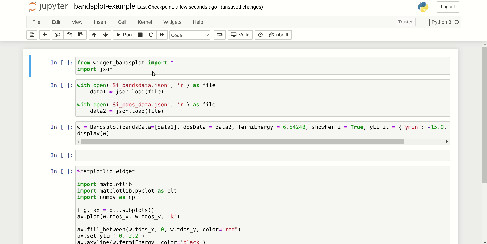

# `widget-bandsplot`: Jupyter Widget to Plot Band Structure and Density of States

[](https://badge.fury.io/py/widget-bandsplot)
[](https://mybinder.org/v2/gh/osscar-org/widget-bandsplot/main?labpath=%2Fexamples%2Fbandsplot-example.ipynb)

A Jupyter widget to plot band structures and density of states. The widget is using the [mc-react-bands](https://github.com/materialscloud-org/mc-react-bands) Javascript package and is turned into a Jupyter widget with [anywidget](https://anywidget.dev/).



## Installation & usage

```sh
pip install widget-bandsplot
```
## Usage

### 1. Plot both the band structure and the density of states (DOS) side by side

```python
w = BandsPlotWidget(bands=[banddata1, banddata2], dos=dosdata, plot_fermilevel = True, show_legend = True, energy_range = {"ymin": -10.0, "ymax": 10.0})
display(w)
```

In order to plot the band structure and density of states, one needs
to provide bands data and DOS data as JSON-files. The examples of the input
JSON-files are provided in the `examples/data` folder. The JSON-files for the
band structure can be exported with the [AiiDA command line interface (CLI) `verdi`](https://aiida.readthedocs.io/projects/aiida-core/en/latest/reference/command_line.html#reference-command-line) as demonstrated in
the code below:

```bash
verdi data band export <PK> --format=json
```

One can plot several band structure input files together with the widget.
The format of the DOS input dict is validate by the [PDOS Schema](https://raw.githubusercontent.com/osscar-org/widget-bandsplot/main/widget_bandsplot/schemas/pdos.json), the exampla valid input is:

```python
dos_data = {
    "fermi_energy": -7.0,
    "dos": [
        {
            "label": "Total DOS",   # required
            "x": [0.0, 0.1, 0.2],   # required
            "y": [1.2, 3.2, 0.0],   # required
            "borderColor": "#41e2b3",   # optional
            "backgroundColor": "#51258b",   # optional
            "backgroundAlpha": "52%",  #optional: A string with integer between 0-100 and '%' in end.
            "lineStyle": "dash",    # optional
        },
        {
            "label": "Co (s↑)",
            "x": [0.0, 0.1, 0.2],
            "y": [1.2, 3.2, 0.0],
            "lineStyle": "solid",
            "borderColor": "#43ee8b",
            "backgroundColor": "#59595c",
        },
        {
            "label": "Co (s↓)",
            "x": [0.0, 0.1, 0.2],
            "y": [1.2, 3.2, 0.0],
            "lineStyle": "solid",
            "borderColor": "#403bae",
            "backgroundColor": "#a16c5e",
        },
    ],
}
```

### 2. Plot only the band structure

```python
w = BandsPlotWidget(bands=[banddata1, banddata2], plot_fermilevel = True, show_legend = True, energy_range = {"ymin": -10.0, "ymax": 10.0})
display(w)
```

### 3. Plot only the density of states (DOS)

```python
w = BandsPlotWidget(dos=dosdata, plot_fermilevel = True, show_legend = True, energy_range = {"ymin": -10.0, "ymax": 10.0})
display(w)
```

When only plotting the density of states, the plot will be shown in
horizontal format.


## Development

Install the python code:

```sh
pip install -e .[dev]
```

You then need to install the JavaScript dependencies and run the development server.

```sh
npm install
npm run dev
```

Open `examples/example.ipynb` in Jupyter notebook or lab to start developing. Changes made in `js/` will be reflected in the notebook.

### Releasing and publishing a new version

In order to make a new release of the library and publish to PYPI, run

```bash
bumpver update --major/--minor/--patch
```

This will

- update version numbers, make a corresponding `git commit` and a `git tag`;
- push this commit and tag to Github, which triggers the Github Action that makes a new Github Release and publishes the package to PYPI.

## Acknowledgements

We acknowledge support from the EPFL Open Science Fund via the [OSSCAR](http://www.osscar.org) project.


